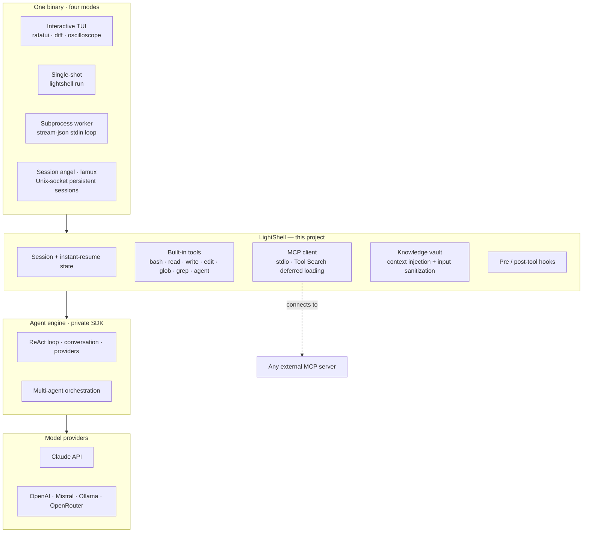

# LightShell

An agentic coding CLI and TUI, built from scratch in Rust on Claude and the Model Context Protocol.

> **Source-available showcase.** This repository documents LightShell's design and engineering. The implementation is proprietary and under active development; the core agent engine is a private SDK. For fully-readable, buildable code extracted from this project, see **[larc-sanitize](https://github.com/TheLightArchitects/larc-sanitize)** (LLM input-safety toolkit: prompt-injection defense + secret redaction, Apache-2.0, CI-green).

LightShell is a coding agent you run in your terminal: a full-screen TUI and a scriptable CLI over the same binary, driving Claude (and other providers) through a real MCP client, a built-in tool suite, sub-agents, and sessions that resume instantly. ~157,000 lines of Rust across 345 source files, **4,100+ tests** in a six-suite pyramid, held to a zero-panic production standard (no `.unwrap()` / `panic!()` in shipping code, enforced in CI).

---

## What it does

- **Multi-provider** — Claude (default), OpenAI, Mistral, Codestral, Ollama (local + cloud), OpenRouter, behind one provider abstraction with automatic fallback.
- **Real MCP client** — connects to any Model Context Protocol server over stdio, with **Tool Search + deferred tool loading** (Anthropic's spec) so large tool sets don't burn context, cutting token use ~85% on tool-heavy sessions.
- **Built-in tool suite** — Bash, file Read/Write/Edit, Glob, Grep, and sub-agent spawning, with streaming execution and diff previews.
- **Full-terminal TUI** — `ratatui` UI with a diff viewer, live tool feed, syntax highlighting, and a real-time activity oscilloscope.
- **Instant-resume sessions** — per-directory session state serializes and restores in a keystroke; pick up exactly where you left off, or `--fresh` for a clean slate.
- **Persistent session angel (lamux)** — a tmux-like Unix-socket daemon that keeps agent sessions alive across attach/detach, with a shared wire protocol so no two sides can drift.
- **Knowledge vault** — injects relevant context from a local Markdown vault into every session, with untrusted-content sanitization on the way in.
- **Hooks + guardrails** — pre/post-tool hooks (cargo check, test guards, assertion guards) that can block a tool call before it runs.
- **Training export** — export sessions to ChatML, ShareGPT, GRPO, DeepSeek-R1, NeMo, and more.
- **Process sandbox** — opt-in OS-level isolation via macOS Seatbelt / Linux Landlock.

---

## Architecture

One binary, four modes, on top of a layered core. The agent engine (the ReAct loop, conversation management, provider transport, and multi-agent orchestration) lives in a **private SDK**; LightShell is the interface, tool, session, and safety layer around it.

---

## Design highlights

**Tool Search with deferred loading.** Instead of paying context for every tool's full schema up front, tools are advertised by name and their schemas are fetched on demand when the model actually reaches for one. On tool-heavy sessions this cut token usage ~85% while keeping every tool reachable.

**Instant-resume sessions.** Session state (conversation, tool history, cursor into the work) is persisted per working directory and restored on launch, so re-opening a project drops you back mid-task rather than at a blank prompt. `LIGHTSHELL_FRESH=1` / `--fresh` opts out.

**lamux — a session angel.** A Unix-socket daemon holds long-lived agent sessions; clients attach and detach like tmux. The wire protocol (`ClientMsg` / `ServerMsg`) is a single shared source of truth, so the daemon and every client are guaranteed to speak the same language.

**Evaluation & reliability.** A six-suite test pyramid — unit, property/stress/chaos, integration, acceptance journeys, security, and **golden-transcript + LLM-judge evals** — guards behavior against regressions. Shipping code is held to a zero-panic standard, enforced by a pre-commit `unwrap-check` and clippy-as-errors.

**Input safety, built in.** Untrusted content (vault entries, tool output, compacted summaries) is sanitized before it reaches the model, and secrets are redacted before anything is logged. That layer is open-sourced in full as **[larc-sanitize](https://github.com/TheLightArchitects/larc-sanitize)** — read it there.

---

## Binary modes

| Mode | Entry | What it's for |
|------|-------|---------------|
| Interactive TUI | `lightshell` | Full-screen coding session |
| Single-shot | `lightshell run "<task>"` | One task, then exit |
| Subprocess worker | `lightshell run --output-format stream-json` | Embedded in a host app; reads prompts from stdin |
| Session angel | `lightshell lamux start` | Persistent sessions over a Unix socket |

---

## Engineering standards

- **Zero-panic** — `.unwrap()` / `.expect()` are blocked in shipping code by a pre-commit script; error paths return typed results.
- **Six-suite test pyramid** — 4,100+ tests, 101 integration files, plus golden-transcript regression and an opt-in LLM-judge rubric.
- **Wire-protocol single source of truth** — the mux protocol types are shared, never duplicated, so the daemon and clients can't drift.
- **Baseline gate** — an A/B + wire-protocol + fingerprint check runs before every push; a regression either gets fixed or an explicit, documented baseline change.
- **Security gates** — secret-scanning and injection-defense tests are part of the suite, not an afterthought.

---

## Tech

Rust · `tokio` · `ratatui` · MCP over stdio · a provider abstraction across six LLM backends · property testing (`proptest`) · OS sandboxes (Seatbelt / Landlock).

---

## Status & license

Actively developed. This repository is a **source-available showcase** — see [LICENSE](LICENSE). The full implementation is proprietary; the extracted input-safety layer is open source at [larc-sanitize](https://github.com/TheLightArchitects/larc-sanitize).

Built solo by [Kevin Tan](https://github.com/theLightArchitect).
